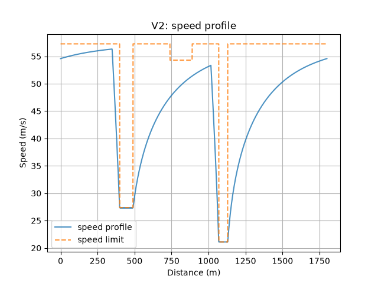

# Lap Time Simulator

A Python-based vehicle lap time simulator built from first principles, applying
vehicle dynamics to model velocity, acceleration, braking, and cornering performance.

## Overview

This project simulates a vehicle's speed around a track by combining:
- A free-body derivation of a vehicle's traction, braking, and cornering limits
- A point-mass vehicle model with a combined friction-circle tyre constraint
- A steady-state bicycle model with per-axle grip, longitudinal load transfer
  and load-sensitive tyres
- A forward/backward speed-profile solver to compute a physically achievable
  speed trace and resulting lap time
- The effects of downforce, drag, and rolling resistance.

The project is developed in versions, each kept in its own folder so the
progression can be followed.

## Versions

### v1 - Point-mass model with friction circle
- Track definition from straight/corner segments, with curvature computed
  at fine resolution along the lap
- Corner speed limits derived from a friction-circle tyre model
- Forward and backward acceleration/braking passes, combined to produce a
  realistic speed profile
- Combined friction-circle constraint, coupling lateral and longitudinal
  tyre force rather than treating them independently 
- Comparison between separate limits and the friction circle

### v1.5 - Powertrain and aerodynamic forces
- Vehicle parameters grouped in a `Vehicle` dataclass
- Power-limited traction: constant maximum force below the motor's base
  speed, constant power above it (F = P/v)
- Aerodynamic drag, downforce and rolling resistance
- Top speed computed from the power–drag balance instead of a fixed cap
- Lap time calculated using the average speed over each segment

### v2 - Bicycle model with load-sensitive tyres
- Steady-state bicycle model: the lateral force each axle must produce is
  set by the cornering acceleration and the CG position
  (Fyf = m·ay·b/L, Fyr = m·ay·a/L), so the car is limited by whichever
  axle saturates first
- Axle loads from static weight distribution, downforce split by aero balance,
  and longitudinal load transfer (m·ax·h/L)
- Load-sensitive tyre friction: μ decreases linearly with tyre load
- Per-axle friction ellipse for combined slip: rear-wheel drive, braking
  split by brake bias
- Front axle check under acceleration: accelerating unloads the front, which
  still has to hold its share of the cornering force (power understeer)
- Corner speed limits solved numerically (Brent's method), since load
  sensitivity and downforce make the equation non-linear in v
- Load transfer handled self-consistently: a fixed-point iteration for
  acceleration (started from the engine limit, so it converges to the
  maximum acceleration), and bisection for braking, where the fixed-point
  iteration does not converge near the cornering limit


## Results

Sample circuit: 1800 m, flying lap (All lap times are for a flying lap: the start speed is found so that the car crosses the line at the same speed it started with.):

| Model | Lap time |
|---|---|
| v1 - separate limits | 37.72 s |
| v1 - friction circle | 37.86 s |
| v1.5 | 41.53 s |
| v2 | 41.84 s |




In v1 the car accelerates at a constant rate. In v1.5 the acceleration drops as speed rises, because above the motor's base speed the drive force falls as P/v while drag grows with v², so the speed levels off towards a top speed set by power and drag rather than by a fixed cap.

The car can also brake later in v1.5, since drag helps slow it down and downforce adds grip at high speed.

Downforce raises the corner speeds since it increases the normal force and in consequence, the maximum grip, and because it grows with v², the gain is much bigger in fast corners than in slow ones. As a result, in the second turn, the car stays below its cornering limit, so it is limited by power rather than grip. In the last turn, the grip limit allows a speed even higher than the car's top speed, so the corner doesn't limit the car at all.

From v1.5 to v2, the straights are unchanged, since both versions use the same power, drag and downforce. The whole difference comes from the two slow corners, where v2's corner speeds are lower. Two effects are new in v2. First, each axle has its own grip limit instead of the grip being pooled for the whole car, so the car is limited by whichever axle saturates first; this costs little here because the aero balance is close to the weight distribution. Second, and more importantly, tyre friction now decreases with load: the more heavily loaded rear tyres have a lower μ than the fronts, and since the car is limited by the weaker axle, this lowers the cornering limit of the whole car.

## Limitations

- v1 and v1.5 are point-mass models: no yaw dynamics, steering, tyre slip angles or load transfer
- v2 is quasi-steady-state: the car is assumed to be in steady cornering at each point, so yaw transients (corner entry and exit) are ignored, which makes lap times slightly optimistic
- The bicycle model lumps each axle into a single tyre, so lateral load transfer is not modelled
- Linear load sensitivity law, with the same μ in the lateral and longitudinal directions
- Combined slip uses a friction ellipse per axle rather than the Magic Formula combined-slip functions
- Drag acts at the CG height in the load transfer, so its pitching moment is ignored; aero balance is constant with speed
- Vehicle parameters are placeholders, not a specific real car

## Roadmap

- [x] v1: Point-mass simulator with friction-circle tyre model and forward/backward speed-profile solver
- [x] v1.5: Power-limited traction (constant-force and constant-power regions)
- [x] v1.5: Aerodynamic drag, downforce and rolling resistance
- [x] v2: Bicycle model with per-axle grip, longitudinal load transfer and load-sensitive tyres
- [ ] v2: Magic Formula outputs: slip angles, steering angle and body slip along the lap
- [ ] v3: Bicycle model with brush model for tyres
- [ ] Import real circuits from centreline coordinates (CSV), with curvature computed from x-y data
- [ ] Suspension and lateral load transfer
- [ ] Validation against real track lap time data

## Project structure

v1/
track.py - track definition and curvature calculation
vehicle.py - vehicle parameters, tyre limits, and forward/backward solver
main.py - runs both models and plots the results
v1.5/
track.py - track definition and curvature calculation
vehicle.py - Vehicle dataclass: forces and acceleration limits
solver.py - corner limits, forward/backward passes and lap time
main.py - runs a full simulation and plots the results
V2/
Track.py - track definition and curvature calculation
Vehicle.py - Vehicle dataclass: axle loads, load-sensitive tyres and per-axle grip limits
Solver.py - corner limits, forward/backward passes with load transfer, flying lap and lap time
Main.py - runs a full simulation and plots the results


## Running it

```bash
git clone https://github.com/charly-james/lap-time-simulator.git
cd lap-time-simulator
python -m venv venv
venv\Scripts\activate          # Windows
pip install -r requirements.txt
cd V2                          # or cd v1.5, cd v1
python Main.py
```
