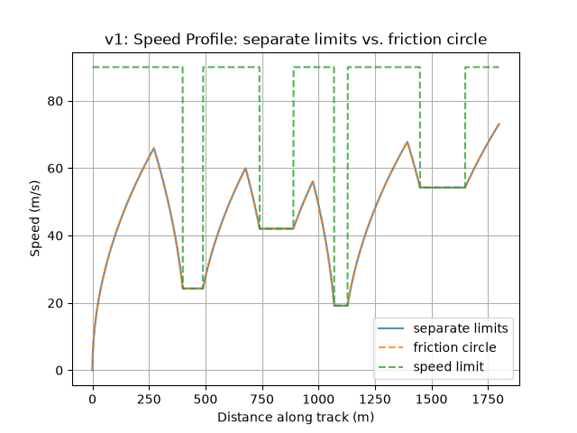
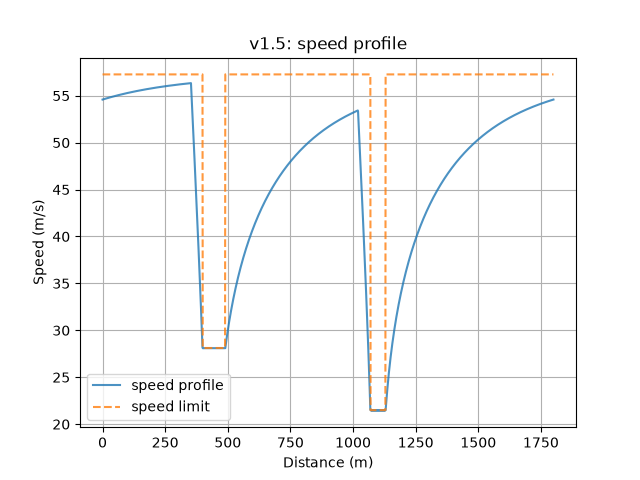

# Lap Time Simulator

A Python-based vehicle lap time simulator built from first principles, applying
vehicle dynamics to model velocity, acceleration, braking, and cornering performance.

## Overview

This project simulates a vehicle's speed around a track by combining:
- A free-body derivation of a vehicle's traction, braking, and cornering limits
- A point-mass vehicle model with a combined friction-circle tyre constraint
- A forward/backward speed-profile solver to compute a physically achievable
  speed trace and resulting lap time
- The effects of downforce, drag, and rolling resistance.

The project is developed in versions, each kept in its own folder so the
progression can be followed.

## Versions

### v1 - Point-mass model with friction circle
- Track definition from straight/corner segments, with curvature computed
  at fine resolution along the lap
- Corner speed limits derived from a friction-circle tyre model
- Forward and backward acceleration/braking passes, combined to produce a
  realistic speed profile
- Combined friction-circle constraint, coupling lateral and longitudinal
  tyre force rather than treating them independently 
- Comparison between separate limits and the friction circle

### v1.5 - Powertrain and aerodynamic forces
- Vehicle parameters grouped in a `Vehicle` dataclass
- Power-limited traction: constant maximum force below the motor's base
  speed, constant power above it (F = P/v)
- Aerodynamic drag, downforce and rolling resistance
- Lap time calculated using the average speed over each segment

## Results

Sample circuit:

| Model | Lap time |
|---|---|
| v1 - separate limits | 44.01 s |
| v1 - friction circle | 44.09 s |
| v1.5 | 47.13 s |




In v1 the car accelerates at a constant rate. In v1.5 the acceleration drops as speed rises, because above the motor's base speed the drive force falls as P/v while drag grows with v², so the speed levels off towards a top speed set by power and drag rather than by a fixed cap.

The car can also brake later in v1.5, since drag helps slow it down and downforce adds grip at high speed.

Downforce raises the corner speeds since it increases the normal force and in consequence, the maximum grip, and because it grows with v², the gain is much bigger in fast corners than in slow ones. As a result, in the second turn, the car stays below its cornering limit, so it is limited by power rather than grip. In the last turn, the grip limit allows a speed even higher than the car's top speed, so the corner doesn't limit the car at all.

## Limitations

- Point-mass model: no yaw dynamics, steering or tyre slip angles (addressed by the bicycle model in v2)
- Tyre grip (μ) is constant and equal in all directions
- No load transfer or suspension effects
- Vehicle parameters are placeholders, not a specific real car

## Roadmap

- [x] v1: Point-mass simulator with friction-circle tyre model
- [x] v1: Forward/backward speed-profile solver
- [x] v1: Combined friction circle (lateral/longitudinal coupling)
- [x] v1.5: Power-limited traction (constant-force and constant-power regions)
- [x] v1.5: Aerodynamic drag, downforce and rolling resistance
- [ ] v2: Bicycle model with Pacejka Magic Formula tyres
- [ ] v3: Bicycle model with brush model for tyres
- [ ] Import real circuits from centreline coordinates (CSV), with curvature computed from x-y data
- [ ] Suspension and load transfer
- [ ] Validation against real track lap time data

## Project structure

```
v1/
  track.py     - track definition and curvature calculation
  vehicle.py   - vehicle parameters, tyre limits, and forward/backward solver
  main.py      - runs both models and plots the results
v1.5/
  track.py     - track definition and curvature calculation
  vehicle.py   - Vehicle dataclass: forces and acceleration limits
  solver.py    - corner limits, forward/backward passes and lap time
  main.py      - runs a full simulation and plots the results
```

## Running it

```bash
git clone https://github.com/charly-james/lap-time-simulator.git
cd lap-time-simulator
python -m venv venv
venv\Scripts\activate          # Windows
pip install -r requirements.txt
cd v1.5                        # or cd v1
python main.py
```

## Background

This project grew out of self-teaching vehicle dynamics and tyre mechanics
(brush model, Pacejka Magic Formula, combined slip) from first principles,
and is being developed incrementally as a way to apply and test that
understanding against real physics and, eventually, real lap time data.